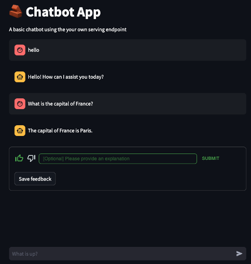

# Databricks App: Streamlit Chatbot w/ Feedback Mechanism  
  
## Introduction
  
This is a basic example of a Databricks App chatbot that uses
- Streamlit for the Chat UI  
- Model Serving for the Chat Model  
- Databricks SQL Serverless to facilitate the feedback loop to a Delta Lake table  
    - There is also an example of using Supabase to log feedback for showing how one could use a PostgreSQL-backed store for the feedback log  

The **feedback log** is a mechanism by which users can send back feedback on the responses generated by the Chat Model used in the application.  

See here:  
  
  
## Setup
  
### Pre-requisites  
1. Databricks Account  
2. Unity Catalog  
3. Ability to create Databricks Apps  
4. Ability to create & use Databricks SQL Serverless  
    - Or ability to create & use a Supabase or other managed postgresql provider  

