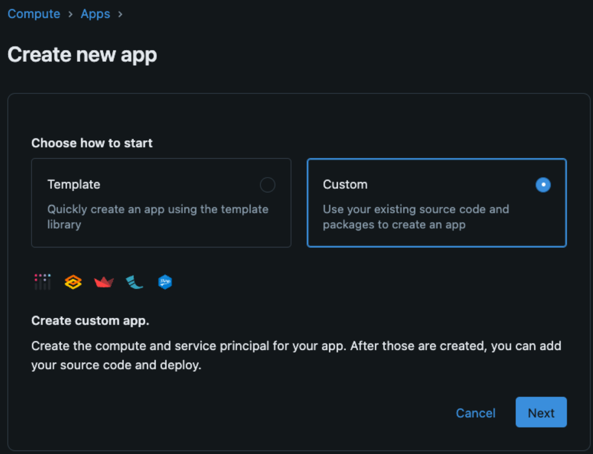
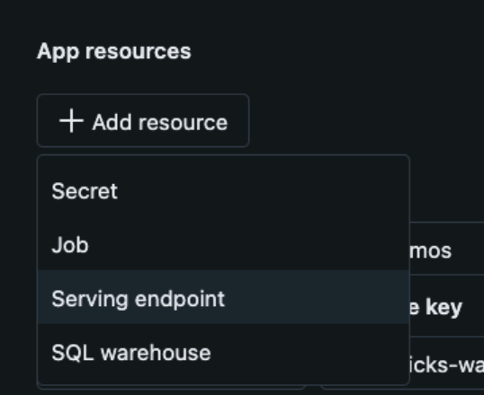

# Databricks App: Streamlit Chatbot for Custom Model Endpoint w/ Feedback Mechanism  
  
## Introduction
  
This is a basic example of a Databricks App chatbot that uses
- Streamlit for the Chat UI  
- Model Serving for the Chat Model  
- Databricks SQL Serverless to facilitate the feedback loop to a Delta Lake table  

The **feedback log** is a mechanism by which users can send back feedback on the responses generated by the Chat Model used in the application.  

 
  
  
## Setup
  
### Pre-requisites  
1. Databricks Account  
2. Unity Catalog  
3. Ability to create Databricks Apps  
4. Ability to create & use Databricks SQL Serverless  
  
### Instructions  
Chatbot Feedback App

1. Clone repo to git folder in workspace
2. OPTIONAL: Run Setup/brand_tone_chain and incorporate more specific prompting to your brand/tone (unless you already have a custom model, just serve it in next step)
2. Run Setup/setup notebook to create secrets, feedback table, model serving endpoint with env vars

6. Go to your Databricks workspace and create a Databricks App  

7. Give the app a name and add the resources necessary for the bot (serving endpoint, secrets)
    - Env vars (5) - search for your secret scope and have one for each and name it the same as is referenced in app.yaml
    - Sql warehouse 
    - Custom chatbot Model Serving Endpoint
    - Click deploy and when prompted add the location of app files pointing to git folder you cloned earlier



This will sync the files to the app and once it is complete go to the Workspace and ensure that app is in a ready state which will be indicated by an active URL being shown to navigate to for the hosted Databricks App. 

### Notes on working with Databricks Apps  
  
  Difference between `value:` and `valueFrom:` in `app.yaml`  
    - For any non-secret value that you want to establish as a environment variable you can directly define it as the following in `app.yaml`  
    ```yaml
    - name: NAME_OF_ENV_VARIABLE
    - value: "ACTUAL_VALUE"
    ```  
    and then in Python you can get this value by referring to it like so:
    ```python
    import os
    my_val = os.getenv("NAME_OF_ENV_VARIABLE")
    ```  
    - For secrets and other resources that you define for the Databricks app (i.e. Serving endpoints, databricks sql warehouses, databricks jobs) you need to use `valueFrom`. This will tell Databricks apps to refer to the defined resource in your Databricks app definition to get the value.  
    ```yaml
    - name: SERVING_ENDPOINT_NAME
    - valueFrom: "serving-endpoint"
    ```  
    and then in Python you can get this value by referring to it like so:
    ```python
    import os
    my_val = os.getenv("SERVING_ENDPOINT_NAME")

