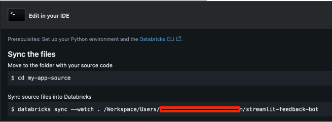

# Databricks App: Streamlit Chatbot w/ Feedback Mechanism  
  
## Introduction
  
This is a basic example of a Databricks App chatbot that uses
- Streamlit for the Chat UI  
- Model Serving for the Chat Model  
- Databricks SQL Serverless to facilitate the feedback loop to a Delta Lake table  
    - There is also an example of using Supabase to log feedback for showing how one could use a PostgreSQL-backed store for the feedback log  

The **feedback log** is a mechanism by which users can send back feedback on the responses generated by the Chat Model used in the application.  

 
  
  
## Setup
  
### Pre-requisites  
1. Databricks Account  
2. Unity Catalog  
3. Ability to create Databricks Apps  
4. Ability to create & use Databricks SQL Serverless  
    - Or ability to create & use a Supabase or other managed postgresql provider  
  
### Instructions  
1. Clone this repository to your local computer  
2. Establish your connection to the Databricks CLI
    - [Setup](https://docs.databricks.com/en/dev-tools/cli/tutorial.html)
    - [Use the Right Version](https://docs.databricks.com/en/dev-tools/cli/migrate.html)  
3. Set up logging method:  
    - **DELTA**: Get the warehouse ID from the Databricks SQL Warehouse that you want to use (recommended to use a Serverless DB SQL Warehouse)
    - **SUPABASE**: Create your Supabase account and project, create a table using the `chat_feedback_tbl.sql` definition as a guide, and get your `SUPABASE_URL` and `SUPABASE_KEY`
4. Establish your .env file (see below for values)  
5. Create a virtualenv for testing from IDE and install dependencies from `requirements.txt`  
6. Go to your Databricks workspace and create a Databricks App  

7. Give the app a name and add the resources necessary for the bot (serving endpoint, secrets)

8. Now when it gets to the App's page in the UI, you will see a section in the middle of the page like the image below. Take the sync path command and run it within the directory of the locally cloned repository on your computer  
  

This will sync the files to the app and once it is complete go to the Workspace and ensure that app is in a ready state which will be indicated by an active URL being shown to navigate to for the hosted Databricks App. 

### Notes on working with Databricks Apps  
  
1. Running / Testing your application locally within an IDE like VS Code  
- Create an `.env` file to mirror all the secrets and values you define as environment variables in your `app.yaml`  
    - With `.env` in the `.gitignore` the file will **not** be committed or pushed to the Databricks workspace, Databricks will only refer to the `app.yaml` for how it should define additional "resources" or "environment variables"  
    - Here is my sample `.env` file keys:  
        ```
        SUPABASE_URL=
        SUPABASE_KEY=
        SERVING_ENDPOINT=
        DATABRICKS_TOKEN=
        FULL_DATABRICKS_HOST=https://xxx.net
        DATABRICKS_WAREHOUSE_ID=
        CHAT_LOG_TABLE=catalog_name.schema_name.table_name
        LOG_METHOD=dbsql
        ```  
    **NOTE**: `DATABRICKS_WAREHOUSE_ID` should just be the ID value at the end of the HTTP Path  
2. Difference between `value:` and `valueFrom:` in `app.yaml`  
    - For any non-secret value that you want to establish as a environment variable you can directly define it as the following in `app.yaml`  
    ```yaml
    - name: NAME_OF_ENV_VARIABLE
    - value: "ACTUAL_VALUE"
    ```  
    and then in Python you can get this value by referring to it like so:
    ```python
    import os
    my_val = os.getenv("NAME_OF_ENV_VARIABLE")
    ```  
    - For secrets and other resources that you define for the Databricks app (i.e. Serving endpoints, databricks sql warehouses, databricks jobs) you need to use `valueFrom`. This will tell Databricks apps to refer to the defined resource in your Databricks app definition to get the value.  
    ```yaml
    - name: SERVING_ENDPOINT_NAME
    - valueFrom: "serving-endpoint"
    ```  
    and then in Python you can get this value by referring to it like so:
    ```python
    import os
    my_val = os.getenv("SERVING_ENDPOINT_NAME")

### Logging Methods  

**Databricks SQL INSERT INTO Delta Lake Table**  

Make sure you have secrets established for the following values in your `app.yaml` (using `valueFrom`, see above note):  
```yaml
  - name: "DATABRICKS_WAREHOUSE_ID_VALUE"
    valueFrom: "databricks-warehouse-id"
  - name: DATABRICKS_TOKEN_VALUE
    valueFrom: "personal-access-token"
  - name: FULL_DATABRICKS_HOST
    valueFrom: "full-databricks-host"
```  
Make sure you have the following filled out as actual values in your `app.yaml`
```yaml
  - name: CHAT_LOG_TABLE
    value: "catalog_name.schema_name.table_name"
  - name: LOG_METHOD
    value: dbsql
```
**NOTE**: `LOG_METHOD` needs to be `dbsql`.  
  
**SUPABASE Logging**  

Make sure you have secrets established for the following values in your `app.yaml` (using `valueFrom`, see above note):  
```yaml
  - name: SUPABASE_URL
  - valueFrom: supabase-url
  - name: SUPABASE_KEY
  - valueFrom: supabase-key
```  
Make sure you have the following filled out as actual values in your `app.yaml`
```yaml
  - name: CHAT_LOG_TABLE
    value: "table_name"
  - name: LOG_METHOD
    value: supabase
```
**NOTE**: `LOG_METHOD` needs to be `supabase`.

